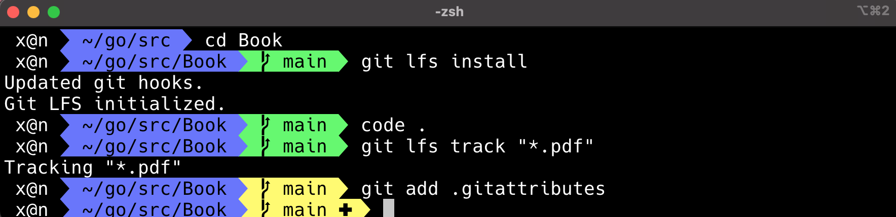

# Book


## Git Large File Storage


Homebrew: 
```go
brew install git-lfs
```

```go
Update your git config to finish installation:

  # Update global git config
  $ git lfs install

  # Update system git config
  $ sudo git lfs install --system
```



```go
git lfs install
```

```go
sudo git lfs install --system
```

```go
git lfs track "*.mp3"

git lfs track "*.pdf"
```

```go
git add .gitattributes
```


